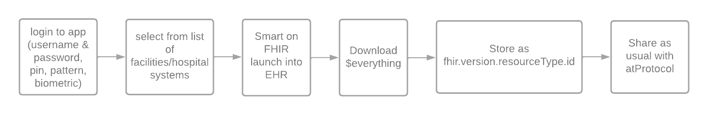

# atsign_fhir

Group of utility classes for working with the atsign and fhir

## Formatting

### Keys for FHIR resources stored on at atSign

    - fhir.version.resourceType.fhirId
    - fhir.stu3.patient.12345  

    full value would be
    - @sharedWith:fhir.version.resourceType.id.nameSpace:@owner
    - @bob:fhir.r4.observation.blood-pressure.fhir:@alice 

### Server Key:Value

    - fhir.permissiongroups.namespace:@fhircentral - list of the different permissionGroups
    - fhir.permission.groupname.namespace:@fhircentral - a specific permission group, value would be a list of atsigns belonging to this group
    - @sharedWith:fhir.request.YYYYMMDDHHMMSSSS:@owner - how a request is logged. 4-digit year, 2-digit month, 2-digit day, 2-digit hour (24 hour format), 2-digit minute, 4-digit second (ss.ss - but no decimal)

## TODO Utilities

### Permission Groups

    - Create new permission group
    - Remove permission group
    - Rename permission group
    - Add atsign to permission group
    - Remove atsign from permission group
    - decide what permission groups actually have access to

### Requests

    - Request listener
    - Check permissions
    - Reform request
    - Log request
    - Make request
    - Receive result
    - Reform result
    - Notify @sign of result

### Listening group

    - a listening group is a list of atsigns that has currently downloaded/requested a particular resource
    - on the server, the key is a typical FHIR resource key (fhir.version.resourceType.id), but the value is the list of atsigns that is listening to that resource
    - Anytime a resource is requested, add the requester to the listening group
    - Anytime a resource is created, add the requester to the listening group
    - Anytime an update occurs for that particular resource, the server pushes the new resource as a notification to all of the listening atsigns

### Patient Workflow

    
